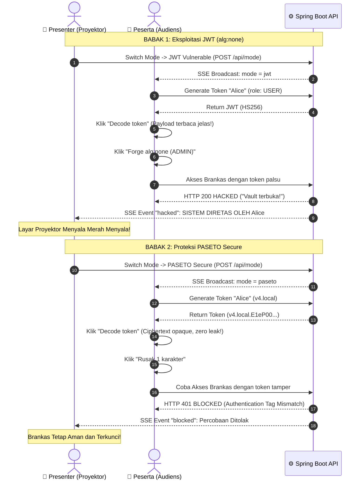

# 🛡️ Live Demo PASETO vs JWT — Java Spring Boot Edition

Aplikasi demonstrasi interaktif berbasis **Java 21 / Spring Boot 3** untuk membandingkan secara langsung karakteristik keamanan, kelemahan arsitektural, dan performa kriptografi antara **JSON Web Token (JWT / RFC 7519)** dan **PASETO (Platform-Agnostic Security Tokens)**.

Aplikasi ini menggunakan pustaka resmi standar industri:
- **JWT**: [`JJWT`](https://github.com/jwtk/jjwt) (`io.jsonwebtoken:jjwt-api:0.12.6`) yang direferensikan oleh [jwt.io](https://jwt.io).
- **PASETO**: [`paseto4j`](https://github.com/nbaars/paseto4j) (`io.github.nbaars:paseto4j-version4:2024.3`) implementasi resmi Java oleh Niels Baars yang direferensikan oleh [paseto.io](https://paseto.io).

---

## 🌟 Fitur Utama

- 📱 **Portal Audience (`/audience.html`)**: Halaman interaktif bagi peserta seminar/workshop untuk mengklaim token, menginspeksi claims, memalsukan token role ADMIN (`alg:none`), merusak token PASETO, dan mencoba membobol brankas rahasia.
- 📽️ **Panggung Presenter (`/presenter.html`)**: Kontrol proyektor bagi pembicara untuk mengubah mode keamanan secara live, memantau *live audit stream* via **Server-Sent Events (SSE)**, dan menampilkan alarm visual merah saat sistem berhasil diretas (*HACKED*).
- ⚡ **Parametric Benchmark Engine (`/benchmark.html`)**: Mesin pengujian kriptografi multi-putaran (10x-30x sampling) berbasis hardware timer (`System.nanoTime()`) dengan perbandingan adil 4 varian: **JWT HS256** (Symmetric MAC), **JWT EdDSA** (Asymmetric Ed25519 ⚖️), **PASETO v4.local** (Symmetric AEAD), dan **PASETO v4.public** (Asymmetric Ed25519 ⚖️).
- 💡 **Interactive Coach Mark**: Panduan *walkthrough* onboarding spotlight interaktif yang **terpisah secara dinamis** sesuai mode aktif (`💡 Panduan Demo (JWT)` dan `💡 Panduan Demo (PASETO)`).
- 🖥️ **Projector-Ready High Visibility**: Tata letak *fluid widescreen* (hingga 1740px) dengan tipografi berukuran besar dan kontras tinggi, sehingga seluruh teks, claims, dan scoreboard terbaca jelas dari jarak jauh di ruangan presentasi.

---

## 🏗️ Mengapa PASETO vs JWT?

| Parameter | JSON Web Token (JWT) | PASETO (v4) |
| :--- | :--- | :--- |
| **Kerahasiaan Payload** | ⚠️ **Plaintext** (Hanya di-encode Base64Url, semua orang bisa mengintip isi token). | ✅ **Terenkripsi Total** pada mode `local` menggunakan AEAD XChaCha20 + BLAKE2b-MAC. |
| **Algorithm Agility** | ❌ **Rentan Desain** (Header token menentukan algoritma verifikasi, memicu celah `alg:none` & *key confusion*). | ✅ **Kebal** (Algoritma terkunci permanen pada versi protokol, tidak ada header dinamis). |
| **Pilihan Kriptografi** | ⚠️ Terlalu fleksibel, mendukung puluhan kombinasi cipher termasuk yang usang. | ✅ Modern & terstandarisasi (XChaCha20, Ed25519, BLAKE2b-MAC, AES-256-CTR). |
| **Ketahanan Tampering** | ⚠️ Bergantung pada algoritma dan kehati-hatian urutan parsing di backend. | ✅ **AEAD Terautentikasi** (Perubahan 1 bit membuat seluruh proses dekripsi gagal seketika). |
| **Key Management** | ❌ Rentan secret lemah pendek (`"secret123"` rawan brute-force). | ✅ Enforced Key Size (wajib tepat 256-bit atau 384-bit). |

---

## 📋 Prasyarat

- **Java Development Kit (JDK)**: Versi 17 atau 21 (direkomendasikan JDK 21).
- **Apache Maven**: Versi 3.8+ (atau gunakan Maven Wrapper).
- **Web Browser**: Chrome, Edge, Safari, atau Firefox.

---

## 🚀 Cara Menjalankan

### 1. Masuk ke Direktori Proyek
```bash
cd /Users/adamfawazzaky/java_demo_paseto
```

### 2. Kompilasi & Jalankan Aplikasi
```bash
mvn spring-boot:run
```
*(Atau build jar lalu jalankan: `mvn clean package -DskipTests && java -jar target/demo-paseto-1.0.0.jar`)*

### 3. Akses Halaman Demo
Setelah server aktif di port `8080`, buka tautan berikut di browser:

| Tampilan | URL Akses Lokal | Keterangan |
| :--- | :--- | :--- |
| **Audience Portal** | `http://localhost:8080/audience.html` | Bagikan URL ini ke peserta / gadget audiens. |
| **Presenter Stage** | `http://localhost:8080/presenter.html` | Tampilkan di layar proyektor panggung. |
| **Benchmark Engine** | `http://localhost:8080/benchmark.html` | Tampilkan untuk analisis performa mendalam. |

> **Tips Presentasi LAN**: Untuk menghubungkan smartphone peserta, pastikan laptop dan HP terhubung di Wi-Fi yang sama, lalu bagikan alamat IP lokal laptop kamu (contoh: `http://192.168.1.15:8080/audience.html`).

---

## 🎬 Skenario Demonstrasi Panggung



---

## 📁 Struktur Direktori

```text
java_demo_paseto/
├── pom.xml                                   # Spring Boot 3.3.4 + paseto4j 2024.3 + JJWT 0.12.6
├── README.md                                 # Dokumentasi lengkap proyek
└── src/
    └── main/
        ├── java/com/sgedts/demopaseto/
        │   ├── DemoPasetoApplication.java    # Main Entry Point Spring Boot
        │   ├── config/
        │   │   ├── TokenConfig.java          # SecretKey & Ed25519/EC KeyPair provider
        │   │   └── WebConfig.java            # CORS & Static resource mappings
        │   ├── controller/
        │   │   ├── AuthController.java       # POST /api/auth/generate
        │   │   ├── VaultController.java      # POST /api/vault/access (Hacked / Blocked)
        │   │   ├── StateController.java      # GET /api/state, POST /api/mode, POST /api/reset
        │   │   ├── BenchmarkController.java  # GET/POST /api/benchmark
        │   │   └── SseController.java        # GET /events (Server-Sent Events)
        │   ├── model/
        │   │   ├── DemoEvent.java            # Immutable event record
        │   │   └── DemoMode.java             # Enum: JWT, PASETO
        │   └── service/
        │       ├── DemoStateService.java     # Ring buffer max 40 event & thread-safe mode
        │       ├── JwtService.java           # HS256 signing & intentional alg:none bypass
        │       ├── PasetoService.java        # paseto4j v4.local & v4.public (spec v4 murni)
        │       ├── BenchmarkService.java     # Hardware timer nano benchmark engine
        │       └── SseService.java           # Multi-client SseEmitter dispatcher
        └── resources/
            ├── application.properties        # Port & key configuration
            └── static/
                ├── audience.html             # UI Peserta
                ├── audience.js               # Logic Peserta & dedicated coachmark tour
                ├── presenter.html            # UI Proyektor Panggung
                ├── presenter.js              # Logic Presenter & event listener
                ├── benchmark.html            # UI Benchmark & comparison matrix
                ├── benchmark.js              # Multi-round benchmark visualizer
                ├── coachmark.js              # Guided tour spotlight module
                └── styles.css                # Projector-ready high visibility styling
```

---

## 📡 Referensi API

| Method | Endpoint | Body / Header | Deskripsi |
| :--- | :--- | :--- | :--- |
| `GET` | `/api/state` | - | Mendapatkan status mode aktif dan daftar 40 audit event terakhir. |
| `POST` | `/api/mode` | `{"mode": "jwt" \| "paseto"}` | Mengganti mode keamanan panggung & memicu broadcast SSE. |
| `POST` | `/api/reset` | - | Membersihkan log event panggung. |
| `POST` | `/api/auth/generate` | `{"name": "Alice", "pasetoFormat": "v4.local"}` | Menerbitkan token baru role `USER` sesuai mode aktif. |
| `POST` | `/api/vault/access` | `Authorization: Bearer <token>` | Mencoba membuka brankas rahasia dengan token yang dikirim. |
| `GET` / `POST` | `/api/benchmark` | `{"rounds": 10, "preset": "standard"}` | Menjalankan mesin benchmark multi-putaran dan kalkulasi latensi. |
| `GET` | `/events` | `Accept: text/event-stream` | Stream Server-Sent Events (SSE) untuk sinkronisasi live. |

---

## ⚙️ Konfigurasi (`application.properties`)

```properties
# Port HTTP server
server.port=8080

# Kunci rahasia untuk demo
demo.jwt.secret=live-demo-jwt-secret-key-32-chars-long
demo.paseto.local-key=live-demo-paseto-local-key-32-bytes

# Static web resources
spring.web.resources.static-locations=classpath:/static/
spring.mvc.static-path-pattern=/**
```

---

## ⚠️ Catatan Keamanan (Security Disclaimer)

1. Proyek ini dibuat murni untuk **tujuan edukasi, presentasi teknis, dan perbandingan performa kriptografi**.
2. Endpoint verifikasi JWT pada `JwtService.java` sengaja dibuat rentan terhadap manipulasi `alg:none` guna mendemonstrasikan kelemahan klasik parsing header JWT tanpa validasi tanda tangan yang ketat.
3. **JANGAN PERNAH** menyalin kode verifikasi JWT rentan ini ke dalam aplikasi produksi!
4. Untuk aplikasi produksi yang menggunakan PASETO, selalu simpan private key di lingkungan aman (Key Vault, HSM, atau Secret Manager) dan lakukan rotasi kunci secara berkala.
